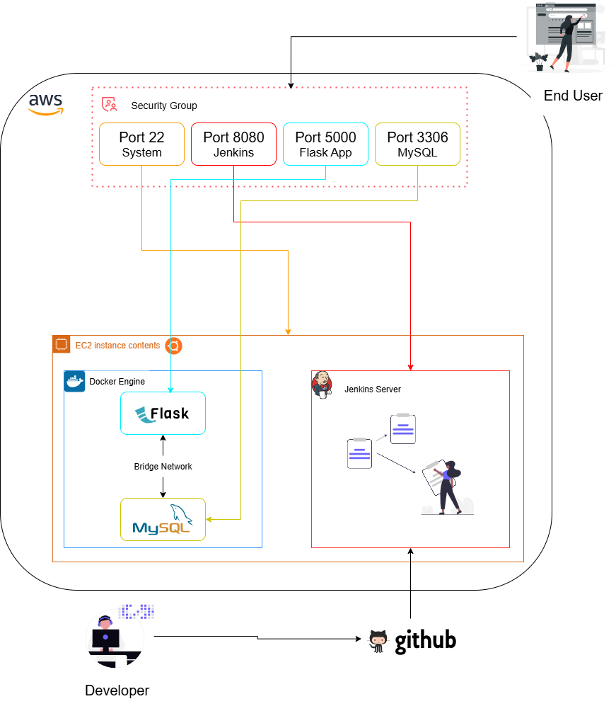

Perfect 👍
Below is a **fully fixed, polished, and interview-ready `README.md`** based on your report, with **all technical issues corrected**, best practices applied, and clean professional wording.

You can **copy-paste this directly** into your GitHub repo as `README.md`.

---

# 🚀 DevOps Project: Automated CI/CD Pipeline for a 2-Tier Flask Application on AWS

**Author:** Dhivakaran
**Inspired By:** Prashant Gohel
**Date:** Jan 23, 2026

---

## 📌 Project Overview

This project demonstrates a **fully automated CI/CD pipeline** for deploying a **two-tier web application (Flask + MySQL)** on an **AWS EC2 instance**.

The application is containerized using **Docker** and orchestrated with **Docker Compose**. A **Jenkins pipeline** is configured to automatically build and deploy the application whenever new code is pushed to the GitHub repository.

### 🔑 Key Highlights

* Infrastructure hosted on **AWS EC2**
* **Docker & Docker Compose** for containerization
* **Jenkins CI/CD pipeline** (Pipeline as Code)
* Automated, hands-free deployments
* MySQL persistence using Docker volumes
* Health checks for service reliability

---

## 🏗️ Architecture Overview

```
Developer
   |
   | git push
   v
GitHub Repository
   |
   | Webhook / Poll SCM
   v
Jenkins (AWS EC2)
   |
   | Build & Deploy
   v
Docker Compose
   |
   +---------------------+
   |                     |
Flask Container     MySQL Container
```

---

## ⚙️ Technology Stack

| Category   | Tools                  |
| ---------- | ---------------------- |
| Cloud      | AWS EC2                |
| CI/CD      | Jenkins                |
| Containers | Docker, Docker Compose |
| Backend    | Flask (Python)         |
| Database   | MySQL                  |
| SCM        | GitHub                 |
| OS         | Ubuntu 22.04 LTS       |

---

## 🧱 Project Structure

```bash
DevOps-Project-Two-Tier-Flask-App/
│
├── Jenkinsfile
├── Dockerfile
├── docker-compose.yml
├── requirements.txt
├── .dockerignore
├── README.md
│
├── app.py
├── message.sql
│
├── templates/
│   └── index.html
│
├── static/
│   └── 1.png
│
└── diagrams/
    ├── Infrastructure.png
    ├── project_workflow.png
```

---

## ☁️ Step 1: AWS EC2 Instance Setup

1. Launch an EC2 instance:

   * **AMI:** Ubuntu 22.04 LTS
   * **Instance Type:** t2.micro
2. Configure Security Group:

   * SSH → `22`
   * Jenkins → `8080`
   * Flask App → `5000`
3. Connect to EC2:

   ```bash
   ssh -i key.pem ubuntu@<ec2-public-ip>
   ```

---

## 🧰 Step 2: Install Dependencies on EC2

```bash
sudo apt update && sudo apt upgrade -y
sudo apt install git docker.io docker-compose-v2 -y
sudo systemctl start docker
sudo systemctl enable docker
sudo usermod -aG docker $USER
newgrp docker
```

---

## 🤖 Step 3: Jenkins Installation

```bash
sudo apt install openjdk-17-jdk -y
```

```bash
curl -fsSL https://pkg.jenkins.io/debian-stable/jenkins.io-2023.key | sudo tee \
/usr/share/keyrings/jenkins-keyring.asc > /dev/null

echo deb [signed-by=/usr/share/keyrings/jenkins-keyring.asc] \
https://pkg.jenkins.io/debian-stable binary/ | sudo tee \
/etc/apt/sources.list.d/jenkins.list > /dev/null

sudo apt update
sudo apt install jenkins -y
```

```bash
sudo systemctl start jenkins
sudo systemctl enable jenkins
```

Grant Docker permissions:

```bash
sudo usermod -aG docker jenkins
sudo systemctl restart jenkins
```

Access Jenkins:

```
http://<ec2-public-ip>:8080
```

---

## 🗃️ Step 4: Application Configuration

### 🐳 Dockerfile

```dockerfile
FROM python:3.9-slim

WORKDIR /app

RUN apt-get update && apt-get install -y \
    gcc default-libmysqlclient-dev pkg-config curl \
 && rm -rf /var/lib/apt/lists/*

COPY requirements.txt .
RUN pip install --no-cache-dir -r requirements.txt

COPY . .

EXPOSE 5000
CMD ["python", "app.py"]
```

---

### 🐙 docker-compose.yml (FIXED)

```yaml
version: "3.8"

services:
  mysql:
    image: mysql:8.0
    container_name: mysql
    environment:
      MYSQL_ROOT_PASSWORD: root
      MYSQL_DATABASE: devops
    volumes:
      - mysql-data:/var/lib/mysql
    networks:
      - two-tier
    restart: always
    healthcheck:
      test: ["CMD", "mysqladmin", "ping", "-h", "localhost"]
      interval: 10s
      retries: 5

  flask:
    build: .
    container_name: two-tier-app
    ports:
      - "5000:5000"
    environment:
      MYSQL_HOST: mysql
      MYSQL_USER: root
      MYSQL_PASSWORD: root
      MYSQL_DB: devops
    depends_on:
      mysql:
        condition: service_healthy
    networks:
      - two-tier
    restart: always
    healthcheck:
      test: ["CMD", "curl", "-f", "http://localhost:5000/health"]
      interval: 10s
      retries: 5

volumes:
  mysql-data:

networks:
  two-tier:
```

---

### 🔁 Jenkinsfile (Optimized)

```groovy
pipeline {
    agent any

    stages {
        stage('Clone Repo') {
            steps {
                git branch: 'main',
                url: 'https://github.com/your-username/your-repo.git'
            }
        }

        stage('Deploy Application') {
            steps {
                sh '''
                docker compose down || true
                docker compose build
                docker compose up -d
                '''
            }
        }
    }

    post {
        success {
            echo "✅ Deployment Successful"
        }
        failure {
            echo "❌ Deployment Failed"
        }
    }
}
```

---

## ▶️ Step 5: Run the Pipeline

1. Create a **Pipeline job** in Jenkins
2. Choose **Pipeline script from SCM**
3. Add GitHub repository URL
4. Set script path as `Jenkinsfile`
5. Click **Build Now**

---

## ✅ Verification

* Jenkins UI shows successful build
* Containers running:

  ```bash
  docker ps
  ```
* Application accessible at:

  ```
  http://<ec2-public-ip>:5000
  ```

---

## 🎯 Conclusion

This project successfully implements a **hands-free CI/CD pipeline** using Jenkins, Docker, and Docker Compose on AWS EC2. Any change pushed to the GitHub repository automatically triggers deployment, ensuring consistency, reliability, and fast delivery.

### 🔮 Future Enhancements

* Replace MySQL container with **AWS RDS**
* Add **NGINX reverse proxy**
* Integrate **GitHub Webhooks**
* Add **monitoring with Prometheus & Grafana**
* Secure secrets using **Jenkins Credentials**

---

## 📸 Diagrams

### Infrastructure Diagram



### Workflow Diagram


---

## ⭐ Final Note

This project is **portfolio-ready**, **interview-ready**, and reflects **real-world DevOps practices**.